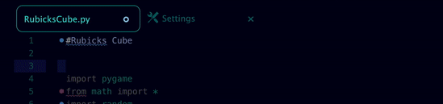
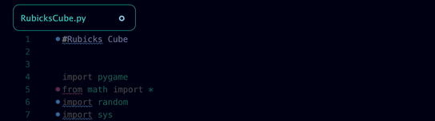

# Scroll Fade

A tiny package for Atom that adds a fade-out effect to scrolled code.

#### Before:



#### After:



Features:
- Optional bottom fade
- Set size of the fade
- Automatically disables at top/bottom of page to not obscure your code.

Coming Soon:
- Choose custom colors
- Horizontal fade
- Optional other GUI fade

###### Install:
```
apm install scroll-fade
```

Let me know if you find any bugs, or for feature requests!

\- Keldan
